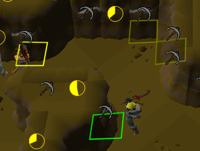

# Motherlode Mine Upper Level Markers

This plugin helps you remember which veins you've mined in
the upper level of the Motherlode Mine as well as keep track
of veins mined by other players.

While not perfect, this will help you identify veins that only
have one ore left in them. This is not a marker to tell you to
avoid them though! Do yourself and everyone around you a favor
by cleaning these leftover veins and help make MLM just a bit
more chill.

For details about the mechanics of the upper level veins in the Motherlode Mine, please visit the
[Old School Runescape Wiki](https://oldschool.runescape.wiki/w/Motherlode_Mine#Upper_level).